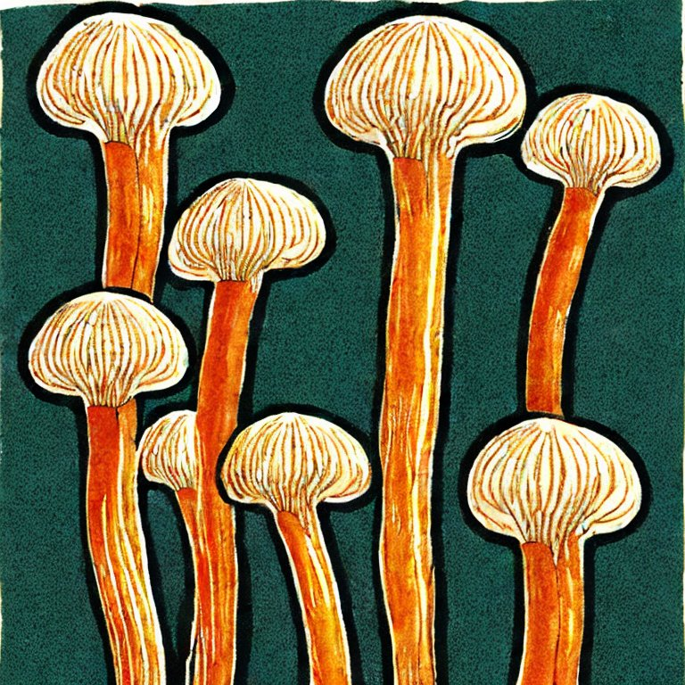

<h1 align="center">Enoki</h1>

  

## Goals and Philosophy

Too many media servers prioritize features and style above unambiguously serving your media. Some go as far as gathering your identifying information and locking core-functionality behind pay walls.

Not Enoki.

Enoki is written with three goals in mind:
1. total ownership of your content and metadata
2. streaming performance no matter the resource requirements
3. free without exception, _liber et gratis_
